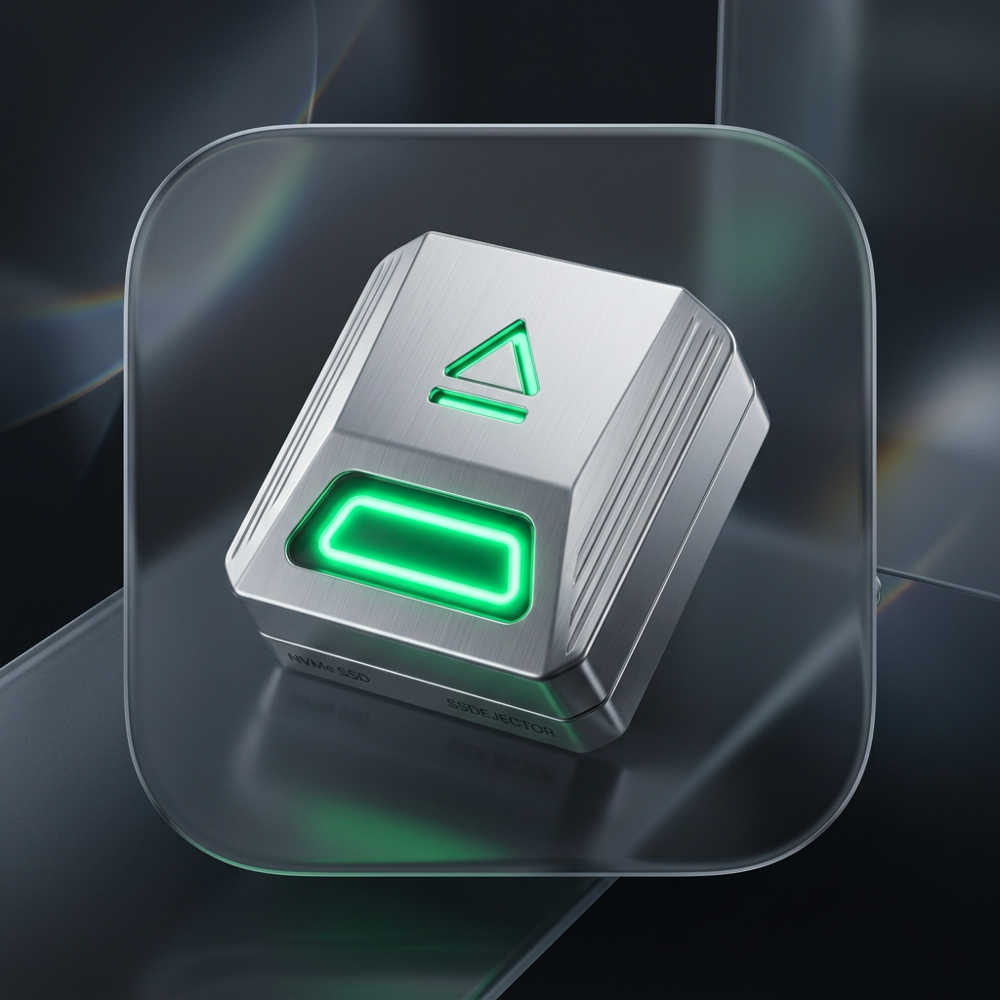
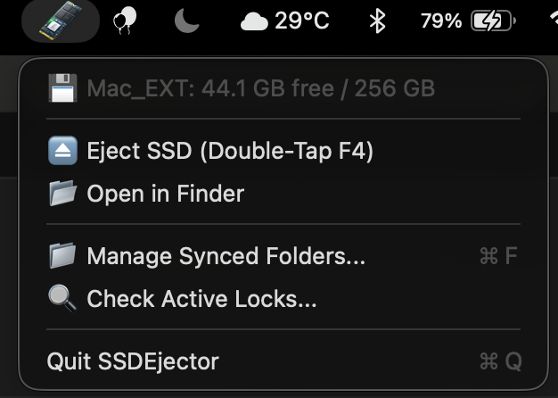
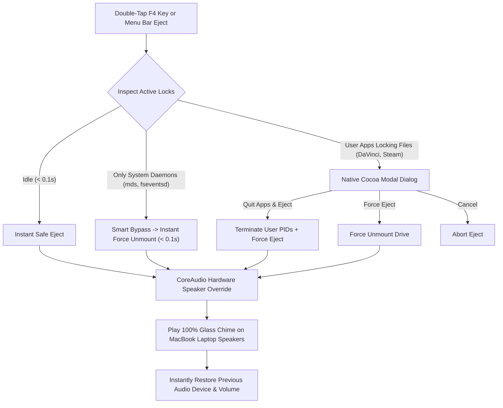

<div align="center">



# ⚡ SSDEjector for macOS

**Instant, Zero-Friction External SSD Management & Universal 3-Tier Storage Orchestrator for Apple Silicon & Intel Macs.**

[-black?style=for-the-badge&logo=apple)](https://apple.com)
[%20%26%20Intel-blue?style=for-the-badge&logo=apple)](https://apple.com)
[](https://swift.org)
[](LICENSE)
[](https://github.com/VedantNarayan/SSDEjector/releases)

<p align="center">
  <b>Double-Tap F4 to Eject</b> • <b>Dynamic M.2 Menu Bar Icon</b> • <b>Universal 3-Tier Storage Orchestrator</b> • <b>Smart System Daemon Bypass</b> • <b>Battery Sleep-Saver</b> • <b>MacBook Physical Speaker Chime</b>
</p>

<br/>



</div>

---

## 💡 Why SSDEjector?

Managing permanently connected external SSDs (e.g., NVMe drives in USB enclosures used for expanded storage) on modern MacBooks comes with subtle friction points:

1. **Slow / Stuck Ejections**: Ejecting from Finder often hangs or fails when background applications (IDEs, games, Wine, DaVinci Resolve) hold open file handles.
2. **False Daemon Prompts**: Background macOS services (`mds_stores`, `quicklookd`, `fseventsd`) constantly trigger annoying *"Volume is in use"* popups even when no user app is open.
3. **Overnight Sleep Battery Drain**: USB/NVMe bridge controllers do not negotiate PCIe ASPM low-power states, continuously pulling **1.5W of power all night** (~12% battery loss over 7 hours).
4. **Audio Routing Friction**: You want audible confirmation that your drive is safe to disconnect, but if Bluetooth headphones or AirPods are connected, standard system beeps play into your pocket or case.
5. **Sidebar Unpinning & Broken Symlinks**: Swapping symlinks on unmount causes macOS Finder to permanently drop pinned folders from your Sidebar Favorites.
6. **Offline File Spillover**: When the SSD is disconnected, folders pointing to external storage break unless seamlessly buffered locally and auto-synced upon reconnection.

**SSDEjector solves all of these problems natively in Swift with zero third-party dependencies.**

---

## ✨ Key Capabilities



---

### 1. 🖥️ Dynamic 4K M.2 SSD Menu Bar Status Item
* **Connected / Mounted**: Displays the **full-color 4K 3D M.2 NVMe SSD stick** with gold contacts, NAND flash chips, and glowing emerald status LED.
* **Ejected / Disconnected**: Automatically transitions to a **high-contrast monochrome slate M.2 SSD stick**.
* **100% Crystal-Clear Alpha**: Pure transparent background with zero smoky halos across all macOS wallpapers and translucent menu bars.

---

### 2. 📁 Universal 3-Tier Storage Orchestrator (`⌘F`)
Click **`📁 Manage Synced Folders...`** in the menu bar to track and sync **any folder on your Mac** with 3 configurable storage tiers:

| Tier | Storage Mode | Internal Mac Storage | Offline Behavior (No SSD) | On Reconnection | Best Used For |
| :---: | :--- | :---: | :--- | :--- | :--- |
| **1** | **⚡ Local Buffer + Mirror Sync** | Uses Folder Size | 🟢 Full access to all historical files | Mirrors updated files to SSD in background | Screenshots, daily active notes |
| **2** | **🧹 Spillover + Auto-Reclaim** | **0 Bytes** (When connected) | 🟢 Saves new files locally (0 errors) | Moves files to SSD & **frees 100% internal space** | Project archives, capture folders |
| **3** | **💾 Direct Storage Offload** | **0 Bytes** | ⚪ Accessible only when connected | Transparent symlink access | Heavy 10GB+ apps, games, raw media |

---

### 3. ⚡ Instant Double-Tap F4 Hardware Key Ejection
* Double-tap your physical **F4 / Spotlight key** to safely unmount your external SSD in **< 0.1 seconds**.
* Powered by **Carbon Global Hotkeys** (`RegisterEventHotKey`) — **Zero Accessibility / TCC permissions required**.
* Built-in **hardware debouncing (80ms – 550ms)** prevents electrical key bounce from causing accidental triggers.

---

### 4. 🛡️ Smart System Daemon Bypass (v4.5+)
* Automatically detects when only read-only macOS background services (`mds`, `mds_stores`, `mdworker`, `fseventsd`, `quicklookd`, `diskarbitrationd`) are touching the drive.
* Bypasses user prompts, flushes disk buffers (`sync`), and force-ejects in **< 0.1s** without annoying modals.
* Real user applications (DaVinci Resolve, Steam, CrossOver, PyCharm) still display the native Cocoa modal.

---

### 5. 🔋 Battery Sleep-Saver (Eliminates Overnight Drain)
* **Auto-Unmount on Sleep**: When your MacBook lid closes or the system goes to sleep (`NSWorkspace.willSleepNotification`), SSDEjector automatically flushes buffers (`sync`) and unmounts the volume.
* **Low-Power USB Mode**: macOS drops USB power draw from **1.5W down to ~0.05W** (saving 10–12% battery overnight).
* **Silent Auto-Remount on Wake**: The moment you open the laptop lid (`NSWorkspace.didWakeNotification`), the drive silently remounts in **~0.1 seconds**.

---

### 6. 🔊 CoreAudio Built-in Speaker Hardware Override
* Uses low-level **CoreAudio HAL APIs** (`kAudioDeviceTransportTypeBuiltIn`) to route the ejection confirmation chime directly to your **physical MacBook Air/Pro laptop speakers at 100% volume**.
* Even if **Bluetooth earphones (AirPods, Galaxy Buds, Sony WH-1000XM), HDMI monitors, or external DACs** are connected, you will always hear the chime loud and clear from the laptop.
* Seamlessly restores your previous audio device and volume level the instant the chime finishes (~0.85s).

---

### 7. 📌 Persistent Finder Sidebar Bookmark Architecture
* Eliminates destructive directory removal on unmount/remount.
* Preserves permanent file inodes so macOS Finder **never purges pinned folders from your Sidebar Favorites**.

---

## 🚀 Installation

### Option 1: Download Pre-built DMG (Recommended)
1. Download the latest `SSDEjector-v4.0.0-macOS.dmg` from [Releases](https://github.com/VedantNarayan/SSDEjector/releases).
2. Open the DMG and double-click **`Install.command`** (or drag `SSDEjector.app` to Applications).

### Option 2: 1-Line Terminal Install
```bash
curl -fsSL https://raw.githubusercontent.com/VedantNarayan/SSDEjector/main/scripts/install.sh | bash
```

### Option 3: Custom Drive Name
If your external SSD has a custom volume label (e.g. `Samsung_T7`, `MyPassport`):
```bash
./scripts/install.sh "Samsung_T7"
```

---

## 🛠️ Building From Source

### Prerequisites
* macOS 12.0+ (Monterey, Ventura, Sonoma, Sequoia, Tahoe)
* Apple Command Line Tools (`xcode-select --install`) or Xcode

### Build & Package DMG
```bash
# Clone the repository
git clone https://github.com/VedantNarayan/SSDEjector.git
cd SSDEjector

# Compile application
./scripts/build.sh

# Create release DMG
./scripts/build_dmg.sh
```

---

## ⚙️ Architecture & Technology Stack

| Component | Technology | Purpose |
| :--- | :--- | :--- |
| **Hotkey Engine** | Carbon Event API (`kVK_F4`) | Zero-permission global double-tap hotkey listener |
| **Audio Routing** | CoreAudio HAL (`AudioObjectGetPropertyData`) | Physical hardware speaker output override |
| **Power Management** | `NSWorkspace.notificationCenter` | Sleep auto-unmount & wake auto-remount |
| **Storage Orchestrator** | `rsync` + JSON Manifest (`.ssdejector_folders.json`) | 3-Tier Multi-Directory auto-sync & space reclamation |
| **Lock Detection** | Kernel `fuser` + Regex PID Parser | Real-time active file descriptor inspection |
| **Process Bypass** | System Daemon Filter Set | Silent auto-eject for `mds_stores`, `quicklookd`, `fseventsd` |
| **Dynamic HUD** | Cocoa `NSStatusItem` + 4K Retina Assets | Real-time M.2 SSD connected/disconnected visual state |
| **Background Supervisor** | macOS `launchd` LaunchAgent | Automatic login launch & instant crash recovery |

---

## 🗑️ Uninstallation

To completely remove SSDEjector and restore default keyboard mappings:
```bash
./scripts/uninstall.sh
```

---

## 📄 License

This project is licensed under the **MIT License** - see the [LICENSE](LICENSE) file for details.

---

<div align="center">
  Developed with ❤️ by <b><a href="https://github.com/VedantNarayan">Vedant Narayan</a></b>
</div>
